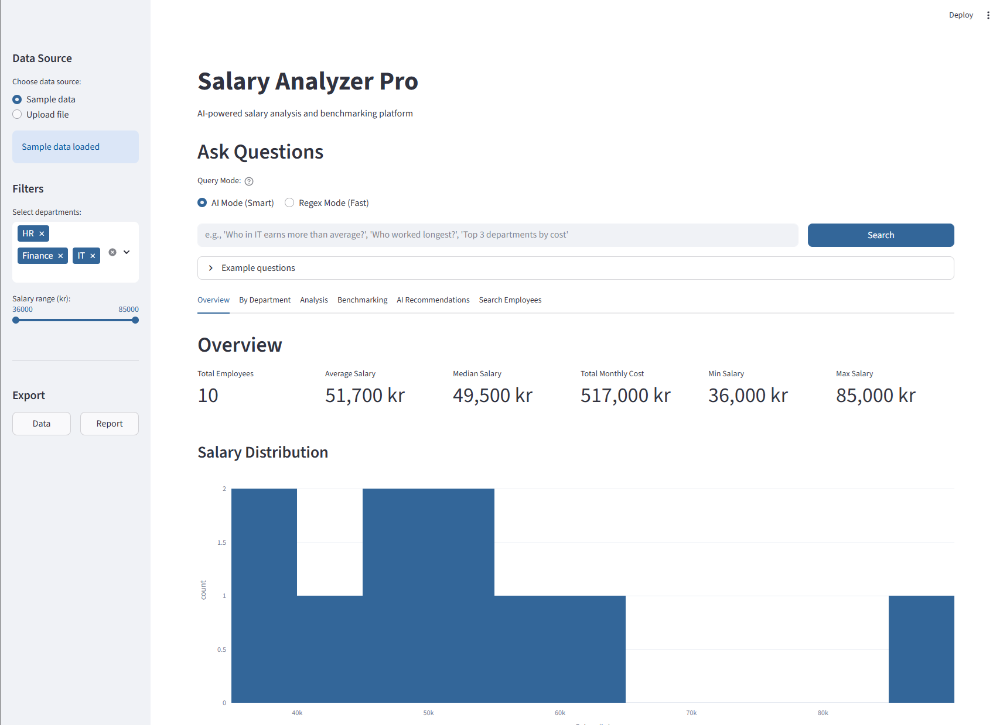
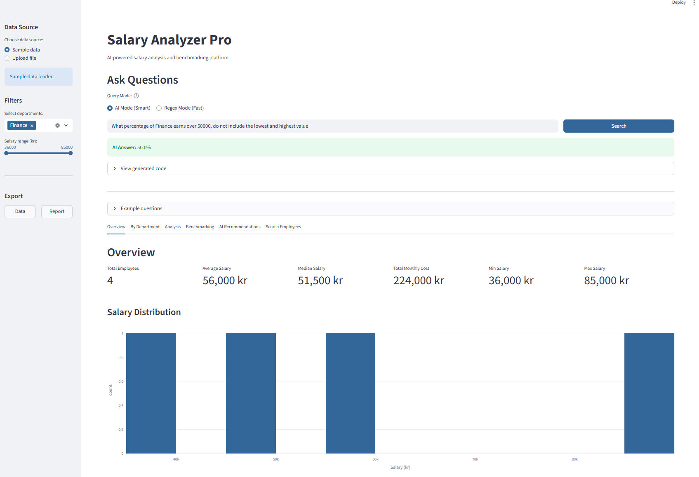
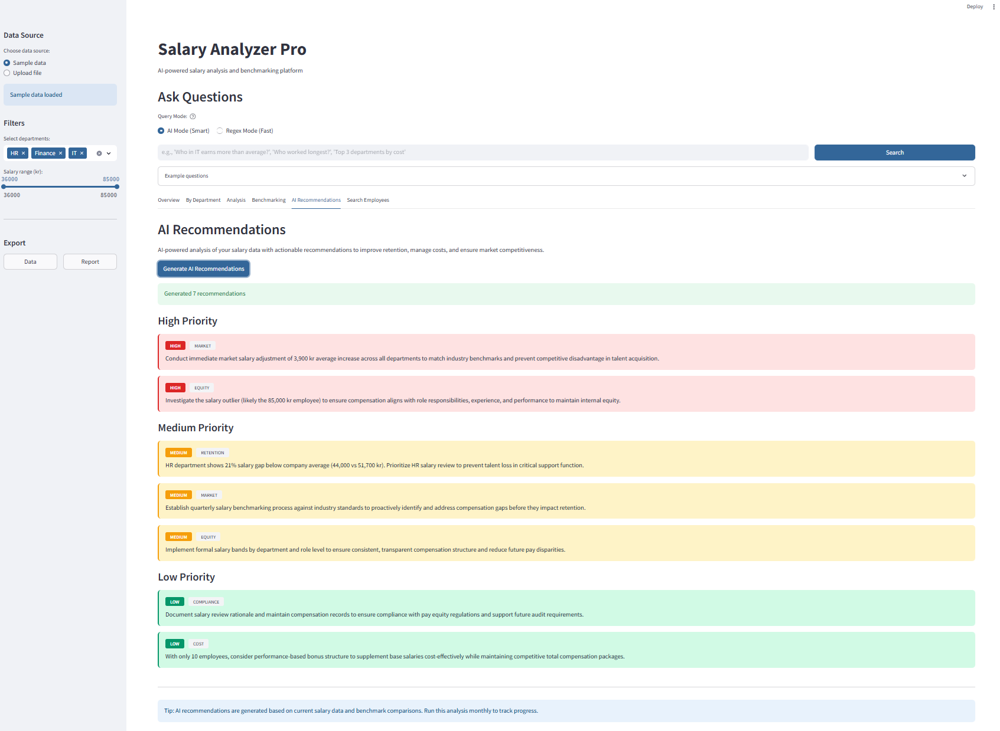

# Salary Analyzer Pro

[](https://opensource.org/licenses/MIT)
[](https://www.python.org/downloads/)

AI-powered salary analysis and benchmarking platform that transforms HR compensation data into actionable insights. Upload salary data, ask questions in plain language, get instant analytics and recommendations.



## The Problem

**For HR Teams:**
- Manual salary analysis takes hours per month
- Difficult to spot pay equity issues
- Benchmarking against market requires manual research
- Ad-hoc questions from leadership need immediate answers
- Risk of biased or inconsistent compensation decisions

**For Management:**
- Lack of real-time salary insights
- Difficult to compare against industry standards
- Can't quickly answer "what if" scenarios
- Missing data-driven compensation strategy

**Time Cost:**
- Monthly salary review: 4-8 hours
- Benchmark research: 6-10 hours
- Ad-hoc analysis requests: 3-5 hours
- **Total: 13-23 hours/month**

## The Solution

Upload your salary data once. Ask questions anytime. Get instant analysis with AI-powered insights and recommendations.

**How it works:**
1. Upload CSV/Excel with salary data (or use sample data)
2. Ask questions: "Who in IT earns more than Finance average?"
3. Get instant visualizations and answers
4. Generate AI recommendations for retention and equity
5. Export comprehensive reports



**Key Features:**
- **Natural language queries** - Ask complex questions in plain language
- **AI & regex dual-mode** - Smart AI or fast pattern matching
- **Salary benchmarking** - Compare against industry standards
- **AI recommendations** - Automated retention & equity insights
- **Excel export** - Professional multi-sheet reports
- **Interactive dashboards** - Beautiful visualizations with Plotly

## Quick Start

### For Non-Technical Users

1. Contact your IT team to set up the application
2. Once running, open the web interface
3. Upload your salary data (CSV or Excel)
4. Start asking questions or explore the dashboards!

### For Developers
```bash
# Clone repository
git clone https://github.com/MattiasNyqvist/salary-calculator.git
cd salary-calculator

# Setup Python environment
python -m venv venv
venv\Scripts\activate  # Windows
source venv/bin/activate  # Mac/Linux

# Install dependencies
pip install -r requirements.txt

# Configure API key (for AI features)
echo ANTHROPIC_API_KEY=your-api-key-here > .env

# Run application
streamlit run app.py
```

Open browser at http://localhost:8501

## Features in Detail

### Natural Language Queries

**AI Mode (Smart):**
Ask complex questions with multiple conditions:
- "Who in IT earns more than the Finance average?"
- "Show top 3 departments by total salary cost"
- "What percentage of HR earns over 45000?"
- "Which roles have the highest median salary?"

**Regex Mode (Fast):**
Quick answers for simple questions:
- "Who earns most in IT?"
- "All with salary over 50000"
- "Average salary Finance"

### Salary Benchmarking


Compare your salaries against industry standards:
- **Market position analysis** - Below/above market categorization
- **Department comparisons** - Visual charts comparing company vs industry
- **Individual analysis** - Each employee's market positioning
- **Automated insights** - AI identifies concerning patterns

**Data source:** Industry benchmark data (customizable)

### AI-Powered Recommendations



One-click generation of actionable recommendations:

**Categories:**
- **RETENTION** - Employees at risk due to below-market pay
- **COST** - Departments with above-market compensation
- **EQUITY** - Pay gaps and fairness issues
- **COMPLIANCE** - Salary practice improvements
- **MARKET** - Strategic positioning adjustments

**Prioritization:**
- **HIGH** - Immediate action required
- **MEDIUM** - Address within quarter
- **LOW** - Monitor and consider

### Data Analysis & Visualization

**Interactive Dashboards:**
- Salary distribution histograms
- Department breakdowns and comparisons
- Box plots showing salary ranges
- Percentile analysis
- Outlier detection (±2 standard deviations)

**Export Options:**
- Simple data export (filtered CSV/Excel)
- Comprehensive reports (multi-sheet Excel with charts)
- Professional formatting ready for presentations

## Tech Stack

**Backend:**
- Python 3.11+
- Pandas (data manipulation)
- NumPy (statistical analysis)

**AI & NLP:**
- Claude AI via Anthropic API (natural language processing)
- Custom regex engine for fast pattern matching

**Frontend:**
- Streamlit (web interface)
- Plotly (interactive visualizations)

**Export:**
- OpenPyXL (Excel generation)
- XlsxWriter (advanced Excel formatting)

**Why these choices:**
- Pandas: Industry standard for data analysis
- Plotly: Interactive, professional visualizations
- Claude AI: Best-in-class reasoning for complex queries
- Streamlit: Rapid development, clean UI

## Usage Examples

### Simple Analysis

**Question:** "Who earns most in IT?"

**Answer:** Shows top earner with salary and role.

### Complex Multi-Condition Queries

**Question:** "Who in IT earns more than the Finance average salary?"

**AI Response:** 
- Calculates Finance department average
- Filters IT employees above that threshold
- Shows list with names, roles, and salaries
- Displays generated Python code for transparency

### Department Comparisons

Navigate to "By Department" tab:
- View average, median, min, max salaries per department
- Interactive bar charts
- Sortable data tables

### Benchmarking Analysis

Upload `salary_benchmarks.csv` with industry data:
- Automatic comparison for each employee
- Visual scatter plots (actual vs industry)
- Department-level comparisons
- Insights on market positioning

## Business Value

### ROI Calculator (Medium Company Example)

**Assumptions:**
- 120 employees
- Monthly salary analysis: 6 hours
- Quarterly benchmarking: 8 hours
- Ad-hoc requests: 4 hours/month
- HR analyst rate: 500 SEK/hour

**Current Annual Cost:**
- Monthly analysis: 6h × 12 = 72h
- Quarterly benchmarking: 8h × 4 = 32h
- Ad-hoc requests: 4h × 12 = 48h
- **Total: 152 hours × 500 SEK = 76,000 SEK/year**

**With Salary Analyzer Pro:**
- Monthly analysis: 30 minutes
- Quarterly benchmarking: 1 hour
- Ad-hoc requests: 5 minutes each
- **Total: ~20 hours × 500 SEK = 10,000 SEK/year**

**Savings: 66,000 SEK/year**

**Implementation:**
- Setup: 5,000 SEK (one-time)
- Running cost: 12,000 SEK/year (API usage for AI features)
- **Net ROI Year 1: 49,000 SEK**
- **Payback period: 1.5 months**

*Scale based on your company size and analysis frequency.*

### Additional Benefits

**For HR:**
- Data-driven compensation decisions
- Proactive retention strategies
- Quick answers to leadership questions
- Professional reports in minutes

**For Management:**
- Real-time salary insights
- Market competitiveness visibility
- Budget planning support
- Equity and compliance assurance

**For Organization:**
- Reduced turnover (identify retention risks early)
- Fair compensation (spot equity issues)
- Competitive advantage (maintain market positioning)
- Cost optimization (identify overpaying areas)

## Project Structure
```
salary-calculator/
├── app.py                    # Main Streamlit application
├── utils.py                  # Data processing & Excel utilities
├── ai_query.py              # AI-powered query engine
├── recommendations.py        # AI recommendation generator
├── version.py               # Version information
├── requirements.txt         # Python dependencies
├── LICENSE                  # MIT License
├── .env                     # API key (not in git)
├── .streamlit/
│   └── config.toml         # UI theme configuration
├── data/
│   ├── sample_salaries.csv  # Example salary data
│   └── salary_benchmarks.csv # Industry benchmarks
└── README.md               # This file
```

## Configuration

### Data Format

**Required columns in salary data:**
- `name` - Employee name
- `department` - Department name
- `role` - Job title
- `salary` - Monthly salary (numeric)

**Optional columns:**
- `employment_date` - Hire date (for tenure analysis)
- `location` - Office location
- `level` - Job level/grade

### Benchmark Data Format

**Required columns:**
- `role` - Job title (must match salary data)
- `industry_avg` - Industry average salary
- `industry_min` - Industry minimum
- `industry_max` - Industry maximum

### Adding Languages

Currently supports English (code) and Swedish (comments). Easy to extend.

## Deployment Options

### Option 1: Local Deployment
```bash
streamlit run app.py
```

Access at http://localhost:8501

### Option 2: Internal Server

Deploy on company server:
```bash
streamlit run app.py --server.port 8501 --server.address 0.0.0.0
```

Configure firewall and SSL as needed.

### Option 3: Cloud Deployment

**Not recommended for salary data** (sensitive information).

Use internal deployment with VPN access instead.

## Troubleshooting

### Upload errors

**Cause:** Incorrect column names or file format  
**Solution:** Ensure CSV/Excel has required columns (name, department, role, salary)

### AI query not working

**Cause:** Missing or invalid API key  
**Solution:** Check .env file has valid ANTHROPIC_API_KEY

### Benchmarking shows no data

**Cause:** Missing salary_benchmarks.csv or role mismatch  
**Solution:** Upload benchmark file with matching role names

## Development

Built using AI-assisted development methodology:
- **Architecture & design:** Human-led problem analysis and solution design
- **Implementation:** AI-assisted rapid prototyping with Claude AI
- **Testing & validation:** Human-verified accuracy with real salary data
- **Production deployment:** Human-managed configuration and delivery

**Development timeline:**
- Traditional approach: 2-3 weeks
- AI-assisted approach: 5 days
- Quality: Production-ready with comprehensive features

**Technologies:** Python, Streamlit, Pandas, Plotly, Claude AI

This demonstrates effective human-AI collaboration in modern software development - combining domain expertise (finance/HR) with AI acceleration.

### Key Technical Learnings

**Data Processing:**
- Pandas optimization for large datasets
- Statistical analysis for outlier detection
- Efficient data filtering and aggregation

**AI Integration:**
- Prompt engineering for accurate query interpretation
- Dual-mode system (AI + regex) for flexibility
- Code generation with transparency

**Visualization:**
- Plotly for interactive, professional charts
- Color schemes for readability
- Responsive layouts for different screen sizes

## Future Enhancements

**Planned:**
- [ ] Historical trend analysis (salary evolution over time)
- [ ] Predictive analytics (turnover risk modeling)
- [ ] Custom benchmark sources integration
- [ ] Role-based access control

**Under Consideration:**
- [ ] HRIS system integration (BambooHR, Workday)
- [ ] Automated email alerts for anomalies
- [ ] Multi-currency support
- [ ] Advanced statistical modeling

## Contributing

Contributions welcome! Please:

1. Fork the repository
2. Create feature branch (`git checkout -b feature/AmazingFeature`)
3. Commit changes (`git commit -m 'Add AmazingFeature'`)
4. Push to branch (`git push origin feature/AmazingFeature`)
5. Open Pull Request

## License

MIT License - See LICENSE file for details.

Free to use, modify, and distribute. Attribution appreciated but not required.

## Author

**Mattias Nyqvist**  
AI Transformation Consultant  
Specializing in Finance & HR Analytics Automation

- GitHub: [@MattiasNyqvist](https://github.com/MattiasNyqvist)
- LinkedIn: [Mattias Nyqvist](https://linkedin.com/in/mattias-nyqvist)

## Acknowledgments

- **Claude AI (Anthropic)** - Natural language processing
- **Plotly** - Interactive visualizations
- **Streamlit** - Rapid web development
- **Pandas** - Data analysis foundation

Built as part of AI Transformation journey - transitioning from Finance Manager to AI Consultant.

---

**Questions? Want to implement this for your company?**  
Reach out on LinkedIn or open an issue on GitHub.